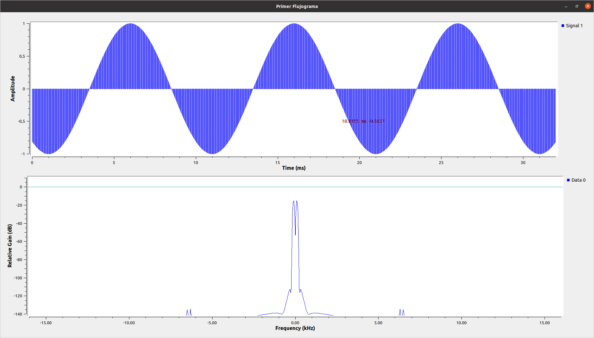
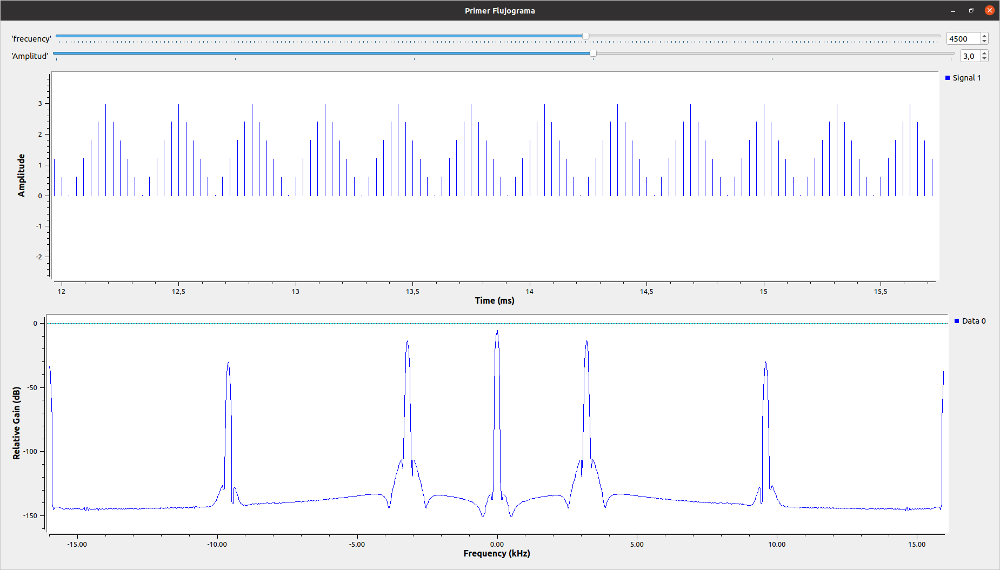

**Laboratorio Tutorial**
En el primer acercamiento a gnuradio utilizamos las caracteristica basicas de este, desdela creacion de diferentes cajitas que nos permiten
representar constantes asi como otras que nos permiten generar señales con caractericas especificas y algunos par la visualisacion y control de las caracteristicas de estas; en esta practica solo se adjunto los archivos de GNU.

**Laboratorio 1A.**

En este laboratorio se realizaron los primero pasos para Modular señales con gnu radio, pudimos experimentar como podemos generar diferentes
tipos de señales asi como realizar modificaciones en amplitud y fase en estas, se exploro la manera de como generar nuestras primera señales teniendo encuentra parametros basicos especificados asi como la representacion y visualizacion de estas en la escala del tiempo y frecuencia.
Acontinuacion algunas de las modulaciones realizadas:

Señal coseno amplitud 1

Señal Triangular amplitud 3

