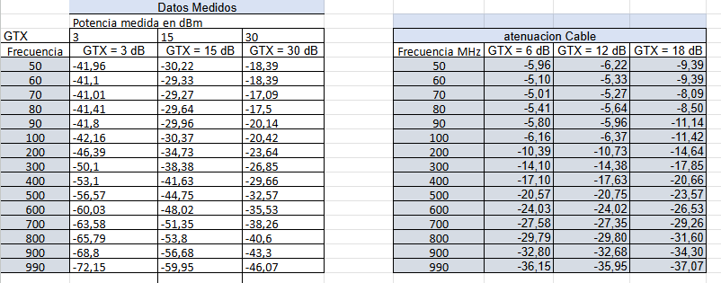
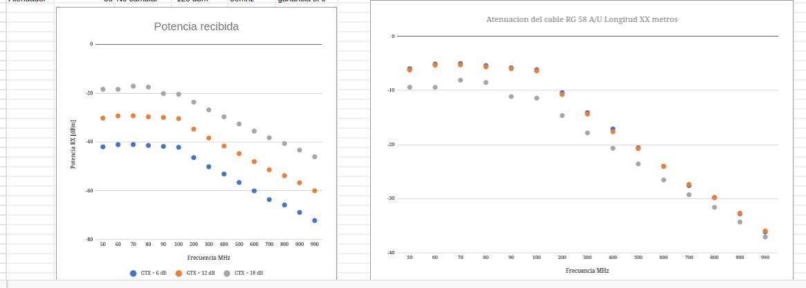

**Laboratorio 1B.**

En esta practica se visualizaron los efectos de la atenuacion en la escala logaritmica de una señal a la cual se le realizaron variaciones
en su frecuencia de la señal, potencia de transmicion y esto se realizo con dos cables(corto y largo) esto para ver como estos aspectos 
afectan la señal de salida.

Estos datos se compilaron en dos tablas y se grafico la potencia recibida en los diferentes casos con la variacion de frecuencia y la 
atenuacion de los cables utilizados.

