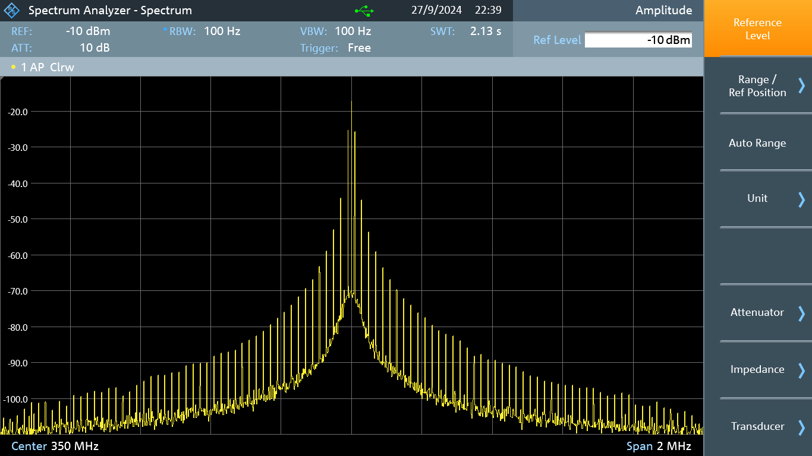
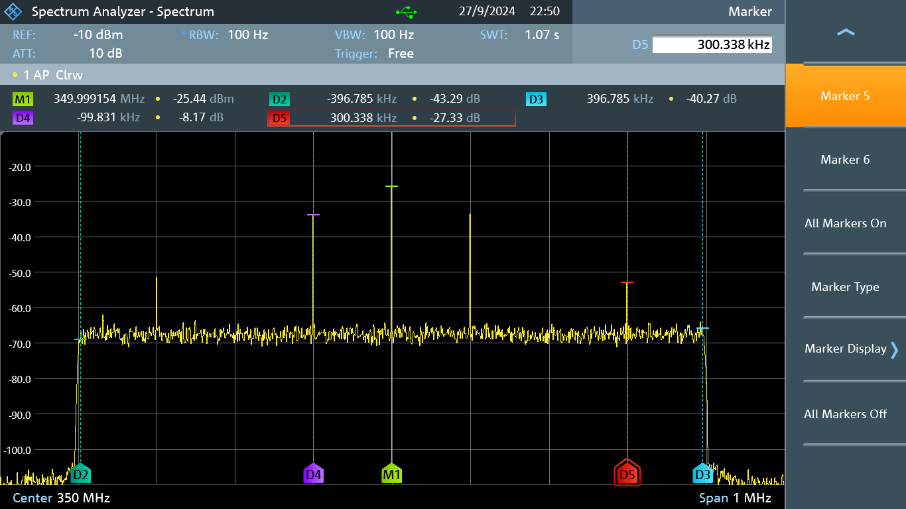
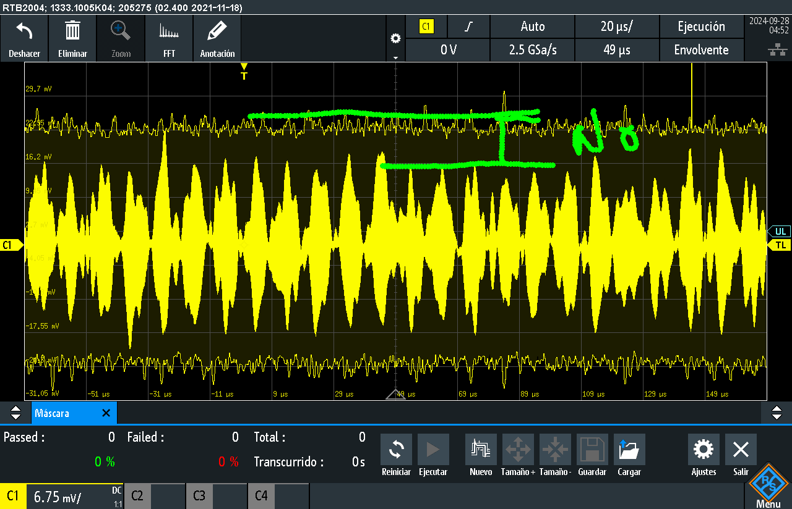
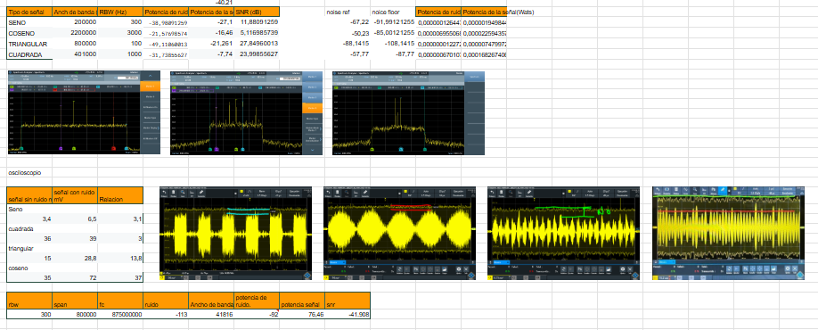

Laboratorio 2B.

En esta practica se realizaron mediciones con los instrumentos a 4 diferentes señales (Seno, coseno, triangular y cuadrada) y en cada una de estas se cambiaron parametros de BW RBW entre otros, con esto se compilaron las datos para realizar los calculos de potencia de ruido, potencia de la señal, relacion señal a ruido tanto con el osciloscopio como con el espectrometro.

Acontinuacion se muestra una de estas señales:

Señal triangular sin acotar.

Señal triangular Restringida por un filtro.

Señal triangular en osciloscopio.

en la segunda parte de este laboratorio tambien se realizo las mediciones de estas caracteristicas a una señal suministrada; todo esto se compilo en una tabla con los resultados de los calculos.

