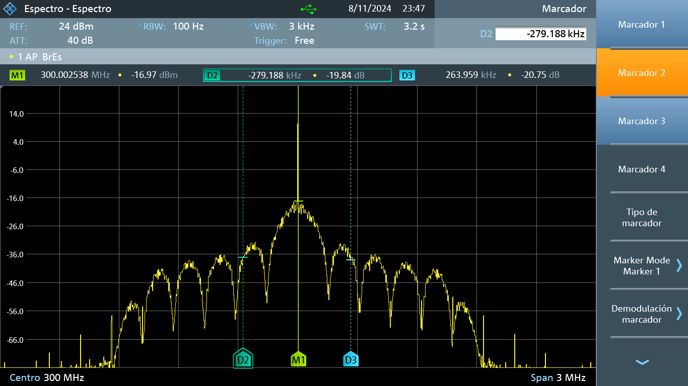
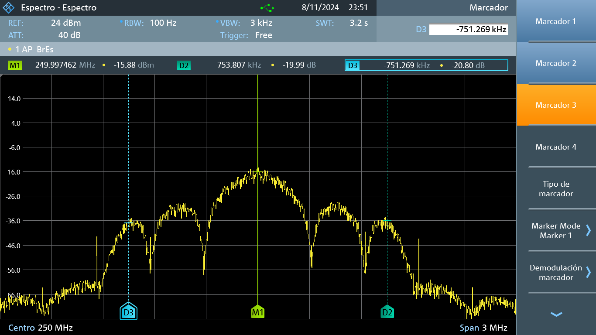
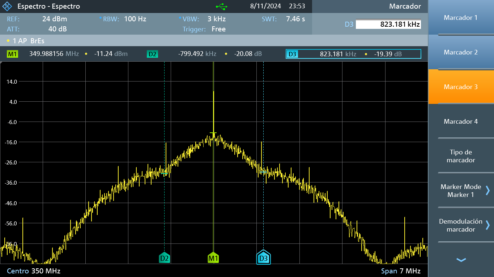
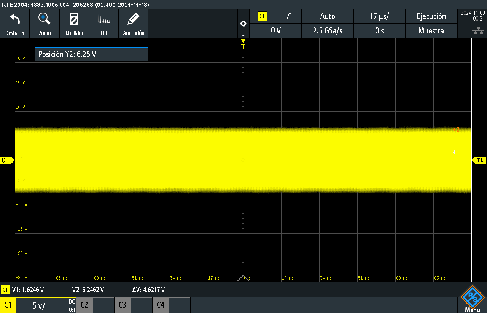

**Laboratorio 3B**

En esta práctica se continuo con el análisis de modulaciones AM en esta ocasión se realizo con señales aleatorias, binarias y una señal de audio. En cada uno
de los casos se realizaron las mediciones de sus características tanto con el osciloscopio como con el espectrometro. En estas señales se abordaron 
los casos de modulaciones del 100%, sobremoduladas y moduladas. Se evidenció que el número de simbolos por muestra va a determinar la forma que toma la señal en el espectrometro, ya que este valor sera el número de armonicos que va a tener la señal.

Con esta práctica se logro mejorar la precisión a la hora de ajustar los instrumentos para obtener los datos necesarios para calcular el indice de modulación, el ancho de banda y demás datos que eran solicitados en el laboratorio. Esto se debe a la diferencia significativa en la forma de las señales medidas lo que permitio, lo que permitio conseguir esta mejora de habilidades.

Diez armonicos

Cinco armonicos

Dos armonicos

Señal modulada

Señal binaria

