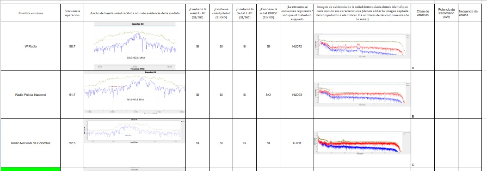
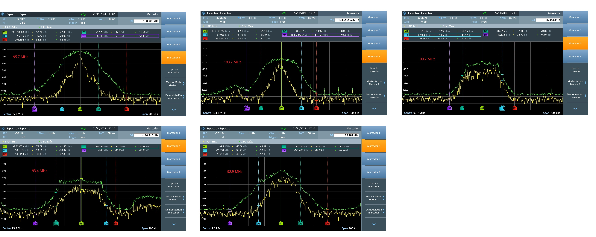

**Laboratorio 4A.**

En esta practica se realizo el analisis,captacion y demodulacion de señales de radio transmitidas en FM, en este caso se captaron diferentes emisoras
y en estas se obserbaron sus caracteristicas principales en banda base y se realizo la medicion de su ancho de banda con varios criterios;
con esto se confirmo el cumplimiento de los parametros de transmicion permitidos.

Acontinuacion una muestra de como se compilaron los datos recopilados

esta practica fue interesante en la observacion de emisoras y otras modulaciones Fm y su captacion como en el segundo que se tomaron 5 principales y se les analizo en el analizador de espectro

