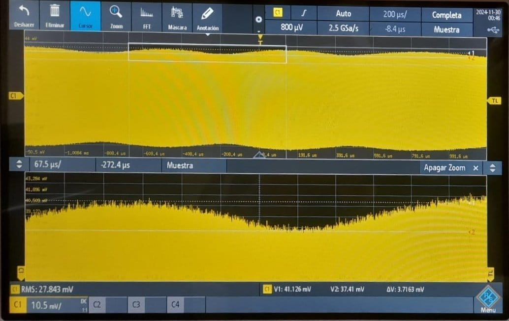
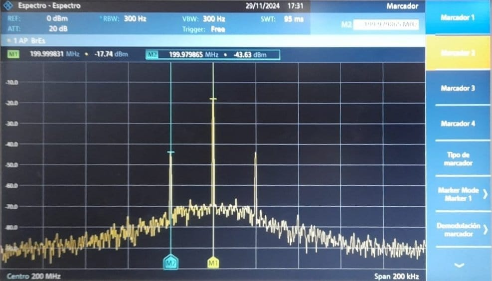
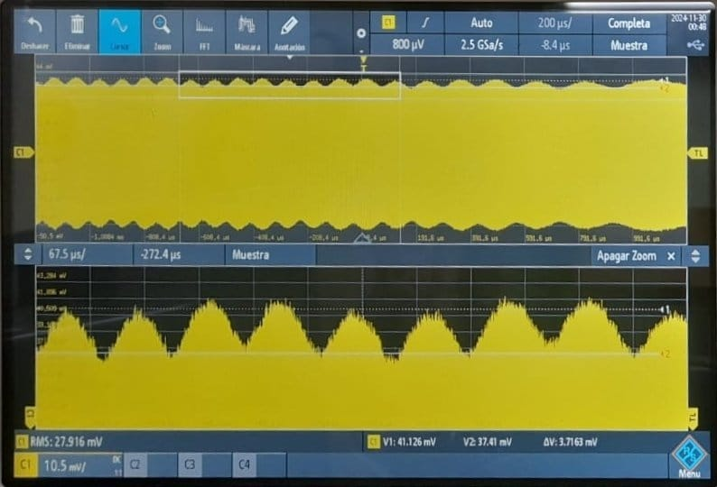
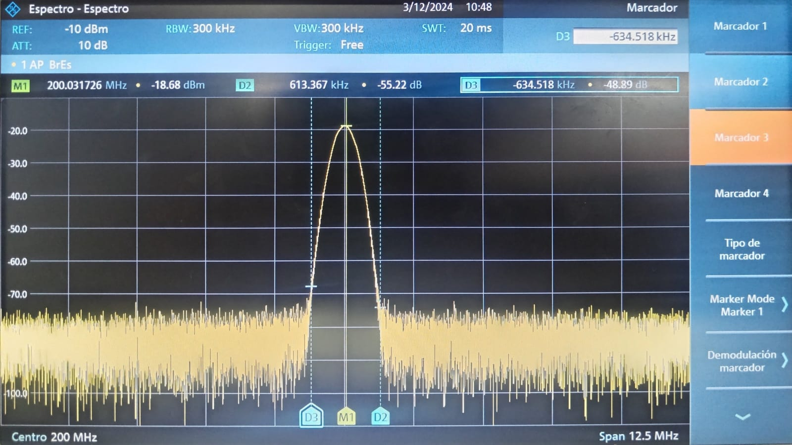
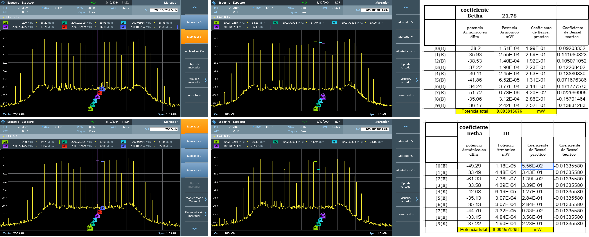

**Laboratorio 4B**

En esta practica se continuo con el analisis, medicion y observacion de caracteristicas de modulaciones FM en banda estrecha y banda ancha y su comportamiento ante la variacion de sus parametros.
 Acontinuacion se muestra el comportamiento de la potencia de la envolvente en comparacion del kpAm=0 con los mencionados, asi como despues se muestra estas en el analizador de espectro, su forma y medicion de ancho de banda.

KpAm<0.1

KpAm>4

A su vez en la segunda parte de esta practica tambien se realizaron los calculos para conocer los coeficientes de Bessel en varios casos donde KpAm>10, especificamente para KpAm= 18 y 22.
esto se recopilo en la siguienteimagen y las respectivas tablas comparando este valor teorico y practico.

